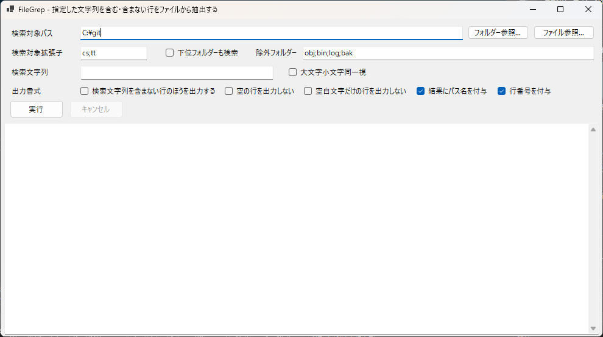

FileGrep
========

指定したフォルダ内のテキストファイルから、**指定した文字列に一致する行／一致しない行** を抽出するための Windows アプリケーションです。

### 主な機能

- **テキスト検索**: ファイル内の指定した検索文字列に一致する行を一覧表示
- **複数ファイル対応**: 対象フォルダー配下の複数ファイルを一括検索
- **ファイルセレクター**: 拡張子による対象ファイルの絞り込み、除外フォルダーに対応
- **否定検索**: 「一致しない行」だけを抽出可能
- **行単位の結果表示**: ファイル名・行番号・該当行テキストを表示

### 動作環境

- OS: Windows 10 以降
- .NET 8.0 ランタイム／SDK

### 使い方（概要）

1. アプリケーションを起動します。
1. 検索対象とするフォルダー（またはファイル）を指定します。
1. 検索したい文字列を入力します。
1. 一致しない行を抽出する等、各種オプションを選択します。
1. 実行ボタンを押すと、結果一覧にファイル名・行番号・テキストが表示されます。
1. 必要に応じて結果をコピーして使用します。

### ライセンス

[LICENSE](LICENSE)
