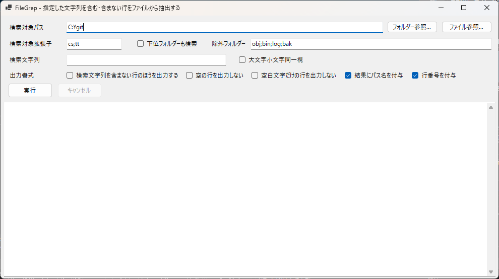

<table><thead><tr>
<th style="text-align:center"><a href="README.en.md">English</a></th>
<th style="text-align:center">日本語</th>
</tr></thead></table>

# FileGrep

指定したフォルダ内のテキストファイルから、**指定した文字列に一致する行／一致しない行** を抽出するための Windows アプリケーションです。

### 説明

FileGrepは、以下の機能を提供します：

- **テキスト検索**: ファイル内の指定した検索文字列に一致する行を一覧表示
- **複数ファイル対応**: 対象フォルダー配下の複数ファイルを一括検索
- **ファイルセレクター**: 拡張子による対象ファイルの絞り込み、除外フォルダーに対応
- **否定検索**: 「一致しない行」だけを抽出可能
- **行単位の結果表示**: ファイル名・行番号・該当行テキストを表示
- **設定の保存**: 画面で指定した内容は保存されて次回起動時に復帰

### 使用方法

1. アプリケーションを起動します。
1. 検索対象とするフォルダー（またはファイル）を指定します。
1. ファイル絞り込み条件を指定します。
    - 検索対象拡張子（`|`区切りで複数指定可能）
    - 下位フォルダーを探すかどうか
    - 除外フォルダー（`|`区切りで複数指定可能）
1. 検索したい文字列を入力します。必要に応じて大文字小文字同一視を指定します。
1. 検索条件を指定します。
    - 検索文字列を含まない行のほうを出力する
    - 空の行を出力しない
    - 空白文字だけの行を出力しない
    - 結果にパス名を付与
    - 行番号を付与
1. 実行ボタンを押すと、結果が表示されます。
1. 結果をコピーする等して活用します。

## システム要件

- Windows 10以上
- .NET 8.0 RC以上

## ビルド

### 必要な環境

- .NET 8.0 SDK以上

### ビルド方法

Visual Studio 2022 以降でビルド。
または、dotnet CLIのある環境で `publish.bat`スクリプトを実行。

### ライセンス

[LICENSE](LICENSE)
